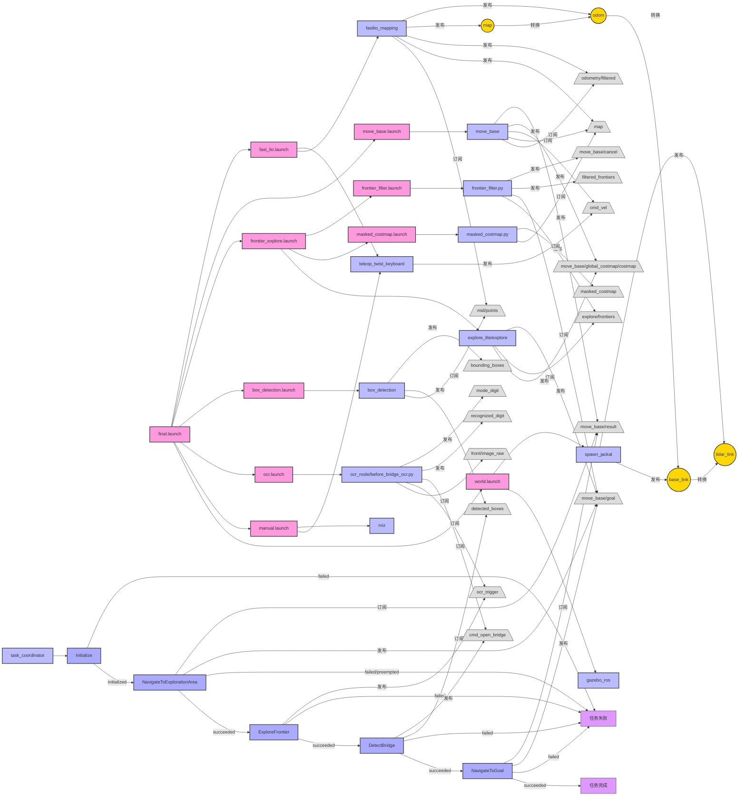

# ME5413 Final Project Group12
## 项目简介

这是ME5413课程的最终项目，实现了具有自主导航、探索、物体检测和OCR功能的机器人系统。此系统基于ROS（机器人操作系统）开发，采用Jackal机器人平台，能够在虚拟环境中完成复杂的导航任务。

## 系统要求

- Ubuntu 18.04/20.04
- ROS Melodic/Noetic
- Python 2.7/3.x
- 库依赖:
  - OpenCV
  - pytesseract
  - scikit-learn
  - numpy
  - smach

## 项目结构

项目主要包含以下模块:

- **fsm**: 有限状态机模块，协调各个任务的执行
- **ocr**: 光学字符识别模块，用于识别环境中的数字信息
- **box_detection**: 盒子检测模块，基于点云数据检测并可视化环境中的盒子
- **frontier_explore**: 前沿探索模块，实现自主探索未知区域
- **navigation**: 导航模块，负责机器人的路径规划和避障
- **SLAM**: 使用FAST-LIO进行同步定位与地图构建

## 安装步骤

1. 创建ROS工作空间:
```bash
mkdir -p ~/catkin_ws/src
cd ~/catkin_ws/src
```

2. 克隆项目:
```bash
git clone https://github.com/CANLAN-SC/ME5413_Final_Project_Group12.git
```

3. 安装依赖:
```bash
sudo apt-get update
sudo apt-get install python-opencv python-numpy ros-$ROS_DISTRO-teleop-twist-keyboard ros-$ROS_DISTRO-gmapping ros-$ROS_DISTRO-move-base
sudo apt-get install tesseract-ocr libtesseract-dev
pip install pytesseract scikit-learn
```

4. 编译工作空间:
```bash
cd ~/catkin_ws
catkin_make
source devel/setup.bash
```

## 运行方法

### 1. 启动所有节点

```bash
roslaunch fsm final.launch
```
应看到终端重复
```bash
[DEBUG] [1743423288.122009188, 605.893000000]: Getting status over the wire.
```
此时仿真环境、rviz、视觉识别、雷达检测、导航、SLAM节点均启动且可以键盘控制仿真小车

> **注意:** 如果遇到 `/usr/bin/env: 'python\r': No such file or directory` 错误，请安装并使用dos2unix修复:
> ```bash
> sudo apt-get install dos2unix
> dos2unix src/ocr/scripts/before_bridge_ocr.py
> dos2unix src/ocr/scripts/after_bridge_ocr.py
> ```

### 2. 加入状态机

新开终端
```bash
cd ME5413_Final_Project_Group12
source devel/setup.bash
python src/fsm/scripts/fsm.py
```

应看到:
```bash
[INFO] [1743423111.980278, 0.000000]: State machine starting in initial state 'INITIALIZE' with userdata: 
        []
[INFO] [1743423111.982093, 0.000000]: Initializing system...
[INFO] [1743423111.983973, 0.000000]: State machine transitioning 'INITIALIZE':'initialized'-->'NAVIGATE_TO_GOAL'
[INFO] [1743423111.985405, 0.000000]: 执行任务三...
[INFO] [1743423111.987305, 0.000000]: State machine transitioning 'NAVIGATE_TO_GOAL':'succeeded'-->'TASK_ONE'
[INFO] [1743423111.988715, 0.000000]: 执行任务一...
[INFO] [1743423111.990916, 0.000000]: 触发消息已发布
[INFO] [1743423127.133987, 562.406000]: State machine transitioning 'TASK_ONE':'succeeded'-->'TASK_TWO'
[INFO] [1743423127.136749, 562.406000]: 执行任务二...
[INFO] [1743423127.139615, 562.408000]: State machine transitioning 'TASK_TWO':'succeeded'-->'TASK_THREE'
[INFO] [1743423127.142591, 562.411000]: 执行任务三...
[INFO] [1743423127.144614, 562.412000]: State machine terminating 'TASK_THREE':'succeeded':'mission_completed'
[INFO] [1743423127.147272, 562.414000]: 状态机执行完毕，结果：mission_completed
```

## 功能说明

- **状态机控制**: 协调导航、探索、检测等任务的执行顺序
- **自主探索**: 使用frontier_explore探索未知区域
- **盒子检测**: 使用DBSCAN聚类算法检测环境中的盒子
- **OCR识别**: 识别环境中的数字，用于桥梁解锁
- **SLAM**: 使用FAST-LIO进行环境建图和定位
- **自主导航**: 使用move_base实现机器人的自主导航

## 系统架构

系统由多个模块组成，主要包括:

1. **主启动文件**：final.launch
2. **传感处理**：fast_lio进行激光SLAM
3. **目标检测**：box_detection检测盒子，ocr进行字符识别
4. **路径规划**：move_base和TEB规划器
5. **前沿探索**：frontier_explore实现未知区域探索
6. **任务协调**：fsm状态机协调各任务执行




## 贡献者

- Group 12 成员

## 许可证

LICENSE文件中详细说明